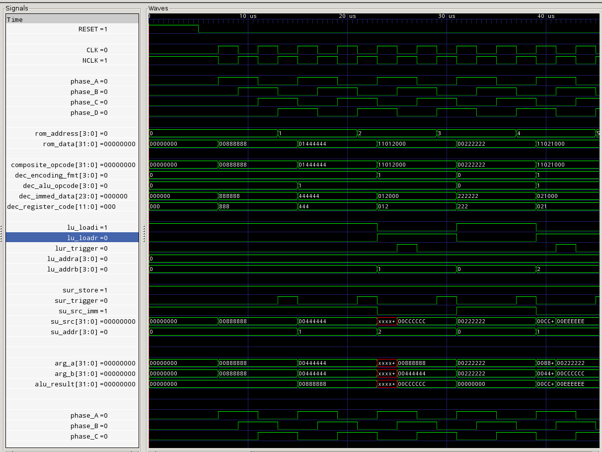

tozPU is just an attempt at learning how to build a CPU with verilog. It is a 32bit minimal nanocontroller with a RISC like instruction set.

Properties:
* 16 32bit general purpose registers
* 4 phase processing (non-pipelined)
  + instruction fetch
  + load / decode
  + exec
  + store / IP Address Calc
* 16 word instruction ROM
* minimal 32 bit ALU

I will eventually split this into non-pipelined minimal and pipelined fast branches. I think it makes sense to keep around the unoptimized minimal version just for reference and learnings sake. I may also port it to MyHDL with the goal of making it even more approachable from a novice standpoint.

